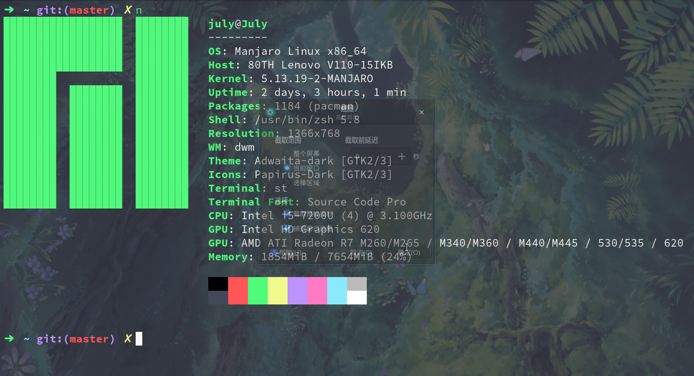
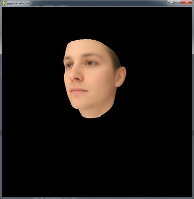

# 基于三维人脸数据的AR互动平台开发

根据已有的三维人脸数据，开发一款基于普通投影仪或显示器和普通相机的人机交互系统，要求
1. 实现三维人脸的渲染和显示；
2. 能识别相机前实时采集的面部表情，比如大笑、沮丧等；能根据面部表情变化对应调整三维人脸数据；
3. 其他个性发挥延拓功能。

## 我使用的系统 `Manjaro`



### Requirements
```sh
pip install pygame
pip install PyOpenGL PyOpenGL_accelerate
pip install numpy
pip install opencv-python
```

## 人脸表情实时识别

基于已训练好的模型进行`人脸表情实时识别`

目前只进行了人脸的检查，还未进行识别

### Demo
1. face_detector.py

## 3D模型加载

使用`pyopengl`进行3d模型的加载

### Demo
1. test_obj.py



You can use mouse to move, rotate and scale it. And you may set lighting for a better viewing. You need to be familiar with opengl.

(鼠标移动，自行设置光照，具体可以看代码)

See the code to learn more. (eg. I use `pickle` to accelerate loading)

2. test_mtl.py


### References


## 移植到树梅派上（还未进行）


## 可能遇到的问题：

1. pyopengl运行不成功,error可能像这样
```
libGL error: MESA-LOADER: failed to open iris: /home/hosameldin/miniforge3/envs/robenv/bin/../lib/libstdc++.so.6: version `GLIBCXX_3.4.29' not found (required by /usr/lib/dri/iris_dri.so) (search paths /usr/lib/dri)
libGL error: failed to load driver: iris
libGL error: MESA-LOADER: failed to open iris: /home/hosameldin/miniforge3/envs/robenv/bin/../lib/libstdc++.so.6: version `GLIBCXX_3.4.29' not found (required by /usr/lib/dri/iris_dri.so) (search paths /usr/lib/dri)
libGL error: failed to load driver: iris
```

> 解决：[参考链接](https://github.com/conda-forge/gazebo-feedstock/issues/81) 
> 
> 在 `×shrc` 配置文件中加入
> ```sh
> export LD_PRELOAD=/usr/lib/libstdc++.so.6 pyopengl
> ```

> 如果你用的是 win， 参考这个[链接](https://blog.csdn.net/qq_45362415/article/details/104531503)


# 参考与感谢 
- [changhongjian](https://github.com/changhongjian/pygame-show-obj)
- [opencv_ai](https://gitee.com/opencv_ai/opencv_tutorial_data?_from=gitee_search)
- [OBJFileLoader](https://www.pygame.org/wiki/OBJFileLoader)
- [BXT-AR-For-Python](https://gitee.com/791529351/BXT-AR4Python)
- [facescape](https://facescape.nju.edu.cn/)


